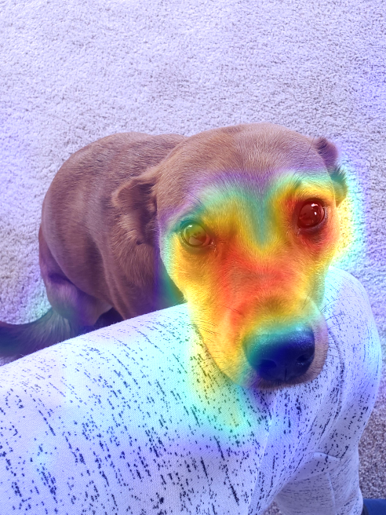
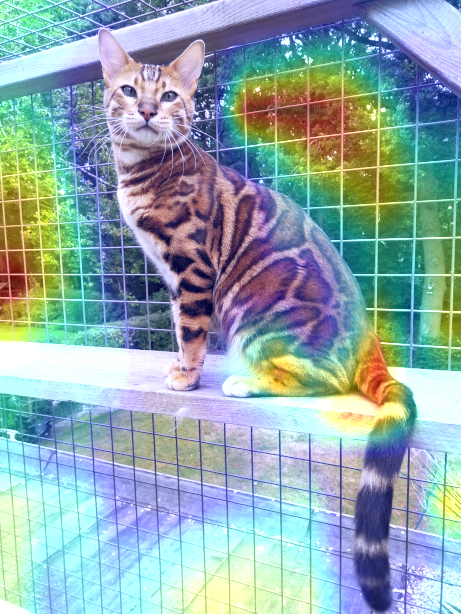

# VGG19-Heatmaps
## In this notebook:
##### - I use Keras Deep Learning Library to import VGG19 and set up an instance of the Convolutional Neural Network.
##### - I write a function to generate heatmaps of the class activations of the CNN and another function to overlay these heatmaps onto the input images using Matplotlib and CV2's Computer Vision library.
##### - I test the functions on images of cats and dogs from the web.
##### - These heatmaps provide a visual aid to better understand what features VGG19 uses to perform its classifications.

### Examples:

### * In case the Github copy does not load, you can also view the notebook on Google Colab: https://colab.research.google.com/drive/17g8jX_qx8yiHbf9pb64mw_uOQDVgrbb-?usp=sharing
